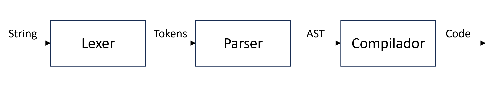

# 2º Projeto PFL

Grupo T08_G02:
- Adriano Alexandre dos Santos Machado (up202105352) - [TBD]
- Tomás Alexandre Soeiro Vicente (up202108717) - [TBD]

## Descrição do trabalho
Este projeto encontra-se dividido em duas partes. Num primeiro momento, foi-nos pedido que implementássemos uma máquina de baixo nível que suportasse instruções aritméticas, booleanas e de controlo de fluxo. Posteriormente foi-nos solicitado a implementação de um compilador, com a finalidade de compilar uma linguagem imperativa para a máquina de baixo nível previamente desenvolvida.

## Parte 1: Implementação de uma máquina de baixo nível
### Estrutura de Dados

**Inst:**

A estrutura de dados Inst representa as instruções da máquina.

```haskell
data Inst =
  Push Integer | Add | Mult | Sub | Tru | Fals | Equ | Le | And | Neg | Fetch String | Store String | Noop |
  Branch Code Code | Loop Code Code
  deriving Show
```
**State:**

O estado é representado por uma bst, onde cada nó contém uma variável, um valor associado e duas sub-árvores. 

```haskell	
data State = Empty 
            | Node String String State State
```
Esta estrutura de dados suporta as seguintes operações:
- newState: cria um novo estado vazio
- fromList: cria um novo estado a partir de uma lista de pares (variável, valor)
- insert: insere um novo par (variável, valor) no estado
- load: retorna o valor associado a uma variável
- toList: retorna uma lista de pares (variável, valor) a partir de um estado
- toStr: retorna uma string a partir de um estado

**Stack:**

A stack é representada por uma lista de strings. 

```haskell
newtype Stack = Stk [String] deriving Show
```

Nesta estrutura de dados existem as seguintes operações:
- newStack: cria uma nova stack vazia
- fromList: cria uma nova stack a partir de uma lista de strings
- push: insere uma nova string na stack
- pop: remove a string no topo da stack
- top: retorna a string no topo da stack
- isEmpty: verifica se a stack está vazia

### Lógica do programa	

A função `run` recebe os argumentos (code, stack, state), enquanto o code não for uma lista vazia, a função `run` executa a instrução que se encontra no topo da lista code e chama recursivamente a função `run` com a lista de instruções restantes.

As instruções suportadas pela máquina são as seguintes:

- Push n: insere o valor n na stack
- Add: soma os dois valores no topo da stack e insere o resultado na stack
- Mult: multiplica os dois valores no topo da stack e insere o resultado no topo da stack
- Sub: subtrai os dois valores no topo da stack e insere o resultado no topo da stack
- Tru: insere o valor tt na stack
- Fals: insere o valor ff na stack
- Equ: verifica se os dois valores no topo da stack são iguais e insere o resultado na stack
- Le: verifica se o segundo valor no topo da stack é menor que o primeiro e insere o resultado na stack
- And: verifica se os dois valores no topo da stack são iguais a tt e insere o resultado na stack
- Neg: verifica se o valor no topo da stack é igual a tt e insere o resultado na stack
- Fetch var: insere o valor associado à variável var na stack
- Store var: remove o valor no topo da stack e insere o valor associado à variável var no estado
- Noop
- Branch c1 c2: se o valor no topo da stack for tt, executa a lista de instruções c1, caso contrário executa a lista de instruções c2
- Loop c1 c2: executa a lista de instruções c1, caso o valor no topo da stack seja tt, executa a lista de instruções c2 e chama recursivamente a função `run`

## Parte 2: Compilador de uma linguagem imperativa
Nesta parte do projeto, foi-nos pedido que implementássemos um compilador para uma linguagem imperativa. Para tal, foram necessárias três etapas.



### Lexer 
Responsável por atribuir tokens a cada elemento da linguagem. 
No nosso caso, a função `lexer` recebe uma string e retorna uma lista de tokens.

**Tokens:**
A nossa linguagem suporta os seguintes tokens:

```haskell
data Token = TokAssign          -- ':='
           | TokSemicolon       -- ';'
           | TokVar String      -- var name
           | TokNumber Integer  -- number
           | TokOpenParen       -- '('
           | TokCloseParen      --')'
           | TokAdd             -- '+'
           | TokSub             -- '-'
           | TokMul             -- '*'
           | TokIf              -- 'if'
           | TokThen            -- 'then'
           | TokElse            -- 'else'
           | TokWhile           -- 'while'
           | TokDo              -- 'do'
           | TokBoolEqu         -- '='
           | TokIntEqu           -- '=='
           | TokLE              -- '<=' 
           | TokNot             -- 'not'
           | TokAnd             -- 'and'
           | TokTrue            -- 'True'
           | TokFalse           -- 'False'    
           deriving (Show, Eq)
```

O nosso lexer funciona da seguinte forma:
- **Espaços:** são ignorados
- **Letras:** a função `lexIdentifier` verifica se a string é uma palavra reservada ou uma variável(começada por uma letra minúscula) e retorna o token correspondente
- **Números:** a função `lexNumber` retorna o token TokNumber (número)
- **Operadores de um caracter, parênteses e ponto e vírgula:** a função `lexer` retorna o token correspondente
- **Operadores com mais do que um caracter:** operadores como o `:=`, `==` e o `<=` são tratados pelas funções `lexAssign`, `lexEqual` e `lexLessEqual` respetivamente

Um exemplo do resultado da função `lexer` é o seguinte:

```haskell
x := 5; x := x - 1;
[AssignStm "x" (NumExp 5), AssignStm "x" (SubExp (VarExp "x") (NumExp 1))]
```

### Parser
Responsável por transformar a lista de tokens numa árvore sintática. É nesta etapa que tratamos a precedência dos operadores. Começamos por definir três estruturas de dados, uma para as expressões aritméticas, outra para as expressões booleanas e outra para as instruções.

```haskell
data Aexp = NumExp Integer      
          | VarExp String     
          | AddExp Aexp Aexp  
          | SubExp Aexp Aexp      
          | MulExp Aexp Aexp      
          deriving Show

data Bexp = TrueExp                
          | FalseExp               
          | EqArExp Aexp Aexp      
          | EqBoolExp Bexp Bexp    
          | LeExp Aexp Aexp       
          | NotExp Bexp           
          | AndExp Bexp Bexp      
          deriving Show

data Stm = AssignStm String Aexp  
          | SeqStm [Stm]          
          | IfStm Bexp Stm Stm    
          | WhileStm Bexp Stm     
          deriving Show
```

### Compilador

## Execução do código
Para proceder à execução do programa, é necessário ter instalado o [GHC](https://www.haskell.org/ghc/). Após a instalação, basta executar o seguinte comando na pasta src:

```haskell
ghci .\main.hs
```
